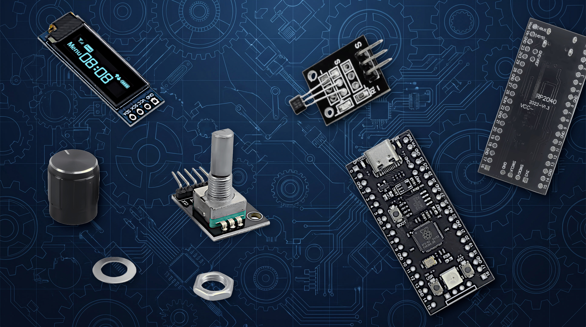
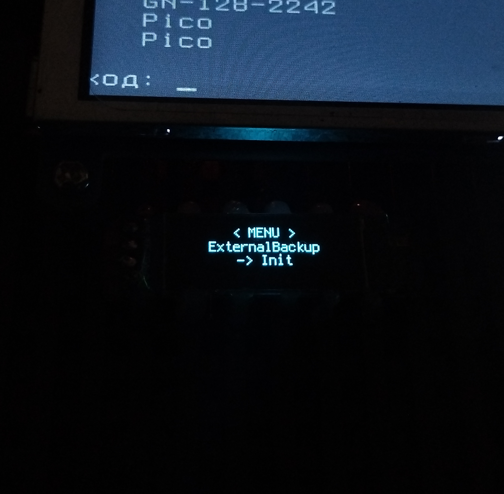
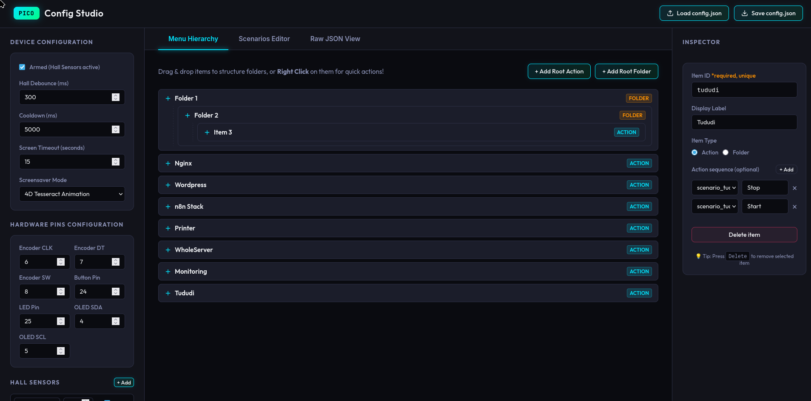

# 🎮 Pico Commander

<div align="center">


**Physical macro pad & server controller with OLED display, rotary encoder, and Hall effect sensors**

[Features](#-features) • [Hardware](#-hardware-scheme) • [Installation](#-installation) • [Quick Start](QUICK_START.md) • [Documentation](docs/) • [Changelog](CHANGELOG.md) • [License](#-license)

</div>

---

## 📋 Overview

**Pico Commander** transforms Raspberry Pi Pico into a powerful physical automation tool that acts as a USB HID keyboard. Control Docker containers, execute complex command sequences, and automate your workflow with a tactile interface featuring:

- **OLED Display (128×32)** — Visual menu navigation with screensavers
- **Rotary Encoder** — Browse menus, execute actions with click/long-press
- **Hall Effect Sensors** — Trigger emergency scenarios (e.g., safe shutdown)
- **INA226 Power Monitor** — Battery voltage/current tracking with low-power warning and auto-screensaver notifications
- **Physical Button** — Boot mode control & emergency actions
- **Multi-level Menus** — Organize commands in nested folders
- **Scenario Pipelines** — Chain multiple actions with loop/toggle support

**For Developers:** Pico Commander isn't a framework you configure around, and it's not a library you import — think of it as an **automation skeleton** or **trigger-pipeline sequencer**. It's a small runtime (**Input → Pipeline → Output**) that ships with working modules already wired in: Hall sensors, battery monitor, HID keyboard emulation, GPIO control for relays and optocouplers. The contract between modules is simple enough that adding your own input or output type doesn't require touching the core loop — just drop in a new handler class and reference it in `config.json`.

See [Pipelines Guide](docs/user/pipelines.md) for how Input → Pipeline → Output actually fits together.

---

## 🖼️ Gallery

<div align="center">

### Hardware Components



*Technical reference: Raspberry Pi Pico, SSD1306 OLED display, KY-040 rotary encoder, Hall effect sensors*

</div>

---

### Device In Action



*Real-world deployment and operational view*

---

### Config Studio Editor



*Web-based JSON editor for visual configuration*

---

### Video Demonstration

**Full Video Demo**: [Watch on YouTube](https://youtu.be/huUQviQJ-Cw)

---

**Use Pico Commander when**:
- You need physical control without SSH
- Visual feedback is important
- Budget is limited
- You prefer open-source solutions
- Emergency hardware triggers are needed

**Consider alternatives when**:
- You need more than 20-30 frequently-used commands (Stream Deck has more buttons)
- Color display is required (Stream Deck)
- You need mouse control (not yet implemented)
- WiFi remote triggers are essential (requires Pico W variant)

---

## ✨ Features

### 🎯 Core Capabilities
- **HID Keyboard Emulation** — Works on any OS without drivers
- **Configurable Menu System** — JSON-based hierarchical menus
- **Action Sequences** — Toggle services (start/stop) with single click
- **Emergency Triggers** — Hall sensor activation for critical scenarios
- **Battery Monitoring** — INA226-based voltage/current tracking with configurable low-battery warnings and screensaver notifications
- **Screen Management** — Auto-sleep and customizable screensavers (Tesseract, Starfield, Matrix)
- **State Persistence** — Remembers menu position and sequence states

### 🛡️ Safety & Reliability
- **Cooldown Protection** — Prevents accidental double-execution (configurable)
- **Priority System** — Hall sensors bypass cooldown for emergency actions
- **Debouncing** — Hardware and software anti-bounce for all inputs
- **Low-Battery Warning** — Blinking OLED alert with encoder-dismiss and cooldown protection (configurable)
- **USB Detection** — Skips scenarios when USB is disconnected

---

## 🔧 Hardware Scheme

```
┌─────────────────────────────────────────────────────────────────┐
│                    Raspberry Pi Pico (RP2040)                   │
│                                                                 │
│  ┌──────────────┐       ┌──────────────┐      ┌─────────────┐ │
│  │ SSD1306 OLED │       │   KY-040     │      │  Hall Sensor│ │
│  │   128×32 px  │       │   Encoder    │      │   (×2)      │ │
│  │              │       │              │      │             │ │
│  │ SDA ──── GP4 │       │ CLK ─── GP6  │      │ OUT1 ── GP15│ │
│  │ SCL ──── GP5 │       │ DT  ─── GP7  │      │ OUT2 ── GP16│ │
│  └──────────────┘       │ SW  ─── GP8  │      └─────────────┘ │
│                         └──────────────┘                        │
│                                                                 │
│  ┌──────────────┐       ┌──────────────┐      ┌─────────────┐ │
│  │ Button       │       │ LED          │      │ GPIO Output │ │
│  │ GP24 (boot)  │       │ GP25 (onboard)│     │ GP14 (opt.) │ │
│  └──────────────┘       └──────────────┘      └─────────────┘ │
│                                                     │           │
│  USB ←──── HID Keyboard Output                     └─→ Relay/  │
│                                                        Opto     │
└─────────────────────────────────────────────────────────────────┘

Power: 5V via USB
Typical Current: <100mA (OLED on), <5mA (screen off)
Note: GPIO output (optional) for controlling relays, optocouplers, or power buttons
```

### 📦 Required Components
| Component | Model/Type | Notes |
|-----------|------------|-------|
| Microcontroller | Raspberry Pi Pico | RP2040-based board |
| Display | SSD1306 OLED 128×32 | I2C interface (0x3C) |
| Encoder | KY-040 Rotary Encoder | With push button |
| Hall Sensors | Hall Effect Sensors (×2) | Active-low or active-high (optional) |
| Button | Tactile Switch | For boot mode selection |
| LED | (Optional) | Built-in LED on GP25 |
| GPIO Output Module | Relay / Optocoupler | For power control automation (optional) |

---

## 🚀 Installation

### Step 1: Flash CircuitPython Firmware

**1.1. Download CircuitPython**

Download the latest CircuitPython 9.0+ UF2 file for Raspberry Pi Pico:
- Official page: https://circuitpython.org/board/raspberry_pi_pico/
- Direct link: [circuitpython-9.x.x-raspberry_pi_pico.uf2](https://circuitpython.org/board/raspberry_pi_pico/)

**1.2. Enter Bootloader Mode**

1. Disconnect Raspberry Pi Pico from USB
2. Hold down the **BOOTSEL** button on the Pico board
3. While holding BOOTSEL, connect Pico to computer via USB cable
4. Release BOOTSEL button
5. Pico appears as a USB mass storage device named **RPI-RP2**

**1.3. Flash Firmware**

1. Copy the downloaded `.uf2` file to the **RPI-RP2** drive
2. The file copies and Pico automatically reboots
3. After reboot, Pico appears as **CIRCUITPY** drive
4. If you see **CIRCUITPY**, installation succeeded ✓

**Verification:**
```bash
# Linux/macOS - check mounted drive
ls /media/$USER/CIRCUITPY  # or check /Volumes/CIRCUITPY on macOS

# Windows - drive letter (e.g., D:, E:, F:)
dir D:\  # Replace D: with actual drive letter
```

---

### Step 2: Install Required Libraries

**2.1. Download Adafruit CircuitPython Library Bundle**

1. **Check your CircuitPython version**:
   - Open `boot_out.txt` on CIRCUITPY drive
   - Look for line like: `Adafruit CircuitPython 9.0.0 on 2024-...`
   - Note the major version (8.x or 9.x)

2. **Download matching bundle**:
   - Go to: https://circuitpython.org/libraries
   - Click **"Download Bundle"** button
   - Or direct link: https://github.com/adafruit/Adafruit_CircuitPython_Bundle/releases/latest
   - Download: `adafruit-circuitpython-bundle-9.x-mpy-YYYYMMDD.zip` (or 8.x if using older CircuitPython)

3. **Extract the ZIP file** to a temporary folder

**2.2. Locate Required Libraries in Bundle**

After extracting, navigate to the `lib/` folder inside the bundle. You need these 3 items:

```
From bundle lib/ folder, copy to CIRCUITPY/lib/:

1. adafruit_displayio_ssd1306.mpy          (single file)
2. adafruit_display_text/                  (entire folder)
3. adafruit_hid/                           (entire folder)
```

**2.3. Copy Libraries to Pico**

**Manual Method** (drag and drop):
1. Open CIRCUITPY drive in file explorer
2. Create `lib/` folder if it doesn't exist
3. Copy the 1 file + 2 folders from bundle to `CIRCUITPY/lib/`

**Command Line Method**:
```bash
# Linux/macOS (adjust paths to your bundle location)
cp /path/to/bundle/lib/adafruit_displayio_ssd1306.mpy /media/$USER/CIRCUITPY/lib/
cp -r /path/to/bundle/lib/adafruit_display_text /media/$USER/CIRCUITPY/lib/
cp -r /path/to/bundle/lib/adafruit_hid /media/$USER/CIRCUITPY/lib/

# Windows (PowerShell)
Copy-Item C:\path\to\bundle\lib\adafruit_displayio_ssd1306.mpy D:\lib\
Copy-Item -Recurse C:\path\to\bundle\lib\adafruit_display_text D:\lib\
Copy-Item -Recurse C:\path\to\bundle\lib\adafruit_hid D:\lib\
```

**Quick Install** (if cloning this repository):

The `lib/` folder in this repo **already contains** all required libraries. Simply copy the entire `lib/` folder to your CIRCUITPY drive:

```bash
# Linux/macOS
cp -r lib/* /media/$USER/CIRCUITPY/lib/

# Windows (PowerShell)
Copy-Item -Recurse lib\* D:\lib\  # Replace D: with your drive
```

**2.4. Verify Library Installation**

Check that CIRCUITPY/lib/ contains:
```
CIRCUITPY/lib/
├── adafruit_displayio_ssd1306.mpy     ✓ Single .mpy file
├── adafruit_display_text/             ✓ Folder with 6 .mpy files
│   ├── __init__.mpy
│   ├── bitmap_label.mpy
│   ├── label.mpy
│   ├── outlined_label.mpy
│   ├── scrolling_label.mpy
│   └── text_box.mpy
└── adafruit_hid/                      ✓ Folder with 8 .mpy files
    ├── __init__.mpy
    ├── consumer_control.mpy
    ├── consumer_control_code.mpy
    ├── keyboard.mpy
    ├── keyboard_layout_base.mpy
    ├── keyboard_layout_us.mpy
    ├── keycode.mpy
    └── mouse.mpy
```

**If libraries missing**: Re-download bundle and verify version match.

---

### Step 3: Deploy Project Files

**3.1. Copy Python Files**

Copy all Python source files to the root of CIRCUITPY drive:

```bash
# Required files (copy to CIRCUITPY root):
boot.py              # Boot configuration & USB mode
code.py              # Main application entry point
config.py            # Configuration loader
config.json          # Menu & scenarios configuration
display.py           # OLED display manager
encoder.py           # Rotary encoder handler
inputs_manager.py    # Unified input handlers (Hall, INA226, button)
output_base.py       # Base class for output modules
output_hid.py        # USB HID keyboard output
output_gpio.py       # GPIO output (relays, optocouplers)
trigger_bus.py       # Pipeline execution engine
screensaver.py       # Screensaver effects (Tesseract, Starfield, Matrix)
ina226_monitor.py    # INA226 power monitor driver
splash_screen.py     # Battery status HUD overlay
splash_trigger.py    # Splash screen interval timer
warning_screen.py    # Low-battery warning overlay
```

**Manual Copy:**
1. Open CIRCUITPY drive in file explorer
2. Drag and drop all `.py` and `.json` files to the root
3. Ensure `lib/` folder exists with libraries from Step 2

**Linux/macOS Quick Deploy:**
```bash
# From project directory
cp *.py *.json /media/$USER/CIRCUITPY/
cp -r lib /media/$USER/CIRCUITPY/
```

**Windows Quick Deploy (PowerShell):**
```powershell
# From project directory
Copy-Item *.py, *.json D:\  # Replace D: with drive letter
Copy-Item -Recurse lib D:\
```

**3.2. Verify File Structure**

Check that CIRCUITPY drive has this structure:

```
CIRCUITPY/
├── boot.py
├── code.py
├── config.py
├── config.json
├── display.py
├── encoder.py
├── inputs_manager.py
├── output_base.py
├── output_hid.py
├── output_gpio.py
├── trigger_bus.py
├── screensaver.py
├── ina226_monitor.py
├── splash_screen.py
├── splash_trigger.py
├── warning_screen.py
├── lib/
│   ├── adafruit_displayio_ssd1306.mpy
│   ├── adafruit_display_text/
│   └── adafruit_hid/
└── (other CircuitPython system files)
```

---

### Step 4: Hardware Assembly

**4.1. Connect Components**

Follow the hardware scheme above. Pin connections:

| Component | Pin Connection | Notes |
|-----------|----------------|-------|
| **OLED Display (SSD1306)** | | |
| SDA | GP4 | I2C Data |
| SCL | GP5 | I2C Clock |
| VCC | 3.3V | Power |
| GND | GND | Ground |
| **Rotary Encoder (KY-040)** | | |
| CLK | GP6 | Encoder clock |
| DT | GP7 | Encoder data |
| SW | GP8 | Push button |
| + | 3.3V | Power |
| GND | GND | Ground |
| **Hall Sensors** | | |
| Sensor 1 OUT | GP15 | Active-low or high |
| Sensor 2 OUT | GP16 | Active-low or high |
| VCC | 3.3V | Power |
| GND | GND | Ground |
| **Boot Button** | GP24 | Tactile switch to GND |
| **LED** | GP25 | Built-in (no wiring needed) |

**4.2. Power Connection**

Connect Raspberry Pi Pico to computer or USB power supply via micro-USB cable.

**Safety Notes:**
- Use 3.3V power for all components
- Do not connect 5V directly to GPIO pins
- Verify polarity before powering on

---

### Step 5: Initial Configuration

**5.1. Edit config.json**

Use the web-based **Config Studio** editor (`editor.html`) or manually edit `config.json`:

**Option A: Visual Editor** (Recommended)
1. Open `editor.html` in a web browser
2. Click **"Load config.json"** and select the file from CIRCUITPY drive
3. Configure hardware pins, menus, and scenarios
4. Click **"Save config.json"**
5. Copy saved file back to CIRCUITPY drive

**Option B: Manual Editing**
1. Open `config.json` in a text editor
2. Modify `hardware` section if using different pins
3. Customize `active_menu` with your menu items
4. Add `scenarios` for your automation tasks
5. Save and copy to CIRCUITPY drive

See [Configuration Guide](docs/user/config-editor.md) for detailed instructions.

**5.2. Verify Configuration**

Check critical settings in `config.json`:

```json
{
  "inputs": {
    "hall_sensor_1": {
      "type": "hall",
      "pin": 15,
      "active_low": true
    }
  },
  "outputs": {
    "hid": {
      "type": "hid",
      "enabled": true
    },
    "opto_pwr": {
      "type": "gpio",
      "pin": 14,
      "enabled": true
    }
  },
  "hardware": {
    "encoder_clk": 6,
    "encoder_dt": 7,
    "encoder_sw": 8,
    "display_sda": 4,
    "display_scl": 5
  },
  "device": {
    "armed": true,
    "cooldown_ms": 5000,
    "screen_timeout_s": 15
  }
}
```

---

### Step 6: First Boot

**6.1. Boot Modes**

Pico Commander has two boot modes:

| Mode | How to Enter | Purpose |
|------|--------------|---------|
| **Normal Mode** | Boot without pressing GP24 button | Runtime operation - file system writable from code |
| **Development Mode** | Hold GP24 button during boot, OR use REPL `storage.remount()` | File editing - USB drive writable, code read-only |

**6.2. Test Boot**

1. Disconnect Pico from USB
2. Reconnect to power (no button pressed = Normal Mode)
3. OLED display should show **"Booting..."** then menu

**Expected Behavior:**
- OLED displays menu items
- Rotary encoder changes selection with swipe animation
- Click encoder executes actions
- LED blinks on startup

**6.3. Enter Development Mode (for editing files)**

**Method 1: Hardware Button (Recommended)**
1. Disconnect Pico
2. Hold **GP24 button**
3. Connect to USB while holding button
4. Release button
5. CIRCUITPY drive is now writable for editing files

**Method 2: Software via REPL (Alternative)**

If you can't physically access the GP24 button, use REPL to remount filesystem:

1. Connect to Pico's serial console (screen, minicom, Mu editor, or Thonny)
2. Press `Ctrl+C` to interrupt running code and enter REPL
3. Run this code:

```python
import storage
storage.remount("/", readonly=False)
# Now you can edit files via REPL or use storage.erase_filesystem() if needed
```

4. To make filesystem writable on next boot, modify `boot.py`:

```python
with open("/boot.py", "a") as f:
    f.write('\n# Enable USB write access\nimport storage\nstorage.remount("/", readonly=False)\n')
import microcontroller
microcontroller.reset()
```

**Warning**: Making filesystem always writable from USB reduces safety (code can't reliably write `state.json`). Use Method 1 when possible.

**Note**: In Normal Mode, `state.json` is auto-created for saving menu position and sequence states.

---

### Step 7: Testing

**7.1. Basic Navigation Test**

1. Rotate encoder → Menu items scroll with animation
2. Click encoder → Executes action or enters folder
3. Long press (>1s) → Returns to parent menu

**7.2. Test Scenario**

Create a simple test scenario:

```json
"scenarios": {
  "test_hello": [
    {"output": "hid", "action": "type", "value": "Hello from Pico Commander!"},
    {"output": "hid", "action": "key", "combo": "enter"}
  ]
}
```

Add menu item:
```json
"active_menu": [
  {
    "id": "test_item",
    "label": "Test Hello",
    "pipeline": ["test_hello"],
    "loop": false
  }
]
```

Open a text editor on your computer, navigate to test item on Pico, click encoder. Text should appear.

**7.3. Test Hall Sensor**

1. Verify sensor wiring and trigger binding in `config.json`
2. Trigger sensor (bring magnet near Hall sensor)
3. Bound scenario should execute

---

### Troubleshooting Installation

| Issue | Solution |
|-------|----------|
| CIRCUITPY drive doesn't appear | Re-flash CircuitPython, try different USB cable/port |
| "No module named..." error | Check library files in `lib/` folder, verify bundle version matches CircuitPython |
| OLED display blank | Verify I2C wiring (SDA/SCL), check I2C address (0x3C), test with i2c scanner |
| Encoder doesn't respond | Check CLK/DT/SW pins, verify `encoder_clk`, `encoder_dt`, `encoder_sw` in config |
| USB keyboard not working | Check `boot.py` enables HID, verify `usb_hid.enable()` line |
| File system read-only error | Boot in Development Mode (hold GP24 button during boot) |
| Scenarios don't execute | Check USB connection, verify scenario name in menu `sequence`, test manually |

---

### 📚 Included Libraries

This project uses the following Adafruit CircuitPython libraries:

| Library | Version | Purpose | License |
|---------|---------|---------|---------|
| **adafruit_displayio_ssd1306** | Latest | SSD1306 OLED display driver | MIT |
| **adafruit_display_text** | Latest | Text rendering and labels | MIT |
| **adafruit_hid** | Latest | USB HID keyboard emulation | MIT |

**System Dependencies:**
- `displayio` — Built-in CircuitPython display framework
- `busio` — Built-in I2C/SPI communication
- `board` — Built-in GPIO pin definitions
- `digitalio` — Built-in GPIO control
- `rotaryio` — Built-in rotary encoder support
- `usb_hid` — Built-in USB HID interface
- `terminalio` — Built-in terminal font

All Adafruit libraries are available under the MIT License.  
Download from: https://circuitpython.org/libraries

**Library Documentation:**
- CircuitPython Core: https://docs.circuitpython.org/
- Adafruit DisplayIO Guide: https://learn.adafruit.com/circuitpython-display-support-using-displayio
- Adafruit HID Guide: https://learn.adafruit.com/circuitpython-essentials/circuitpython-hid-keyboard-and-mouse

---

## 📖 Documentation

Comprehensive guides available in the `docs/` directory:

- **[Config Editor Guide](docs/user/config-editor.md)** — Web-based visual configuration tool
- **Configuration Examples** — See `config.json` for reference implementation

---

## ⚙️ Configuration

### Visual Editor

Use `editor.html` for a graphical configuration interface with drag-and-drop menu builder, scenario editor, and validation. See [Config Editor Guide](docs/user/config-editor.md) for complete documentation.

### Manual Configuration

#### Basic Menu Item
```json
{
  "id": "docker_service",
  "label": "Docker App",
  "pipeline": [
    {"scenario": "scenario_docker_stop", "label": "Stop"},
    {"scenario": "scenario_docker_start", "label": "Start"}
  ],
  "loop": true
}
```

**Notes:**
- `pipeline`: Array of scenarios to execute
- `loop: true`: Toggle mode — each click cycles through pipeline (Stop → Start → Stop...)
- `loop: false`: Chain mode — executes entire pipeline in one click

#### Nested Submenu
```json
{
  "id": "servers",
  "label": "Servers",
  "submenu": [
    {
      "id": "web",
      "label": "Web Server",
      "pipeline": ["scenario_restart_web"],
      "loop": false
    }
  ]
}
```

#### Scenario Example
```json
"scenarios": {
  "scenario_docker_stop": [
    {"output": "hid", "action": "enter", "count": 3},
    {"wait": 200},
    {"output": "hid", "action": "type", "value": "docker-compose stop"},
    {"output": "hid", "action": "key", "combo": "enter"}
  ],
  "scenario_test_gpio": [
    {"output": "hid", "action": "type", "value": "Pressing power button..."},
    {"output": "hid", "action": "key", "combo": "enter"},
    {"wait": 500},
    {"output": "opto_pwr", "action": "gpio_pulse"},
    {"wait": 500},
    {"output": "hid", "action": "type", "value": "Done!"},
    {"output": "hid", "action": "key", "combo": "enter"}
  ]
}
```

**Notes:**
- Each step specifies `"output"` field (defaults to `"hid"` if omitted for backward compatibility)
- HID and GPIO actions can be freely mixed in one scenario (see `scenario_test_gpio` example)
- `{"wait": ms}` pauses execution between steps

### Supported Actions

| Action | Output | Description | Parameters |
|--------|--------|-------------|------------|
| `type` | `hid` | Type text string | `value` (string) |
| `key` | `hid` | Press key combination | `combo` (e.g., "ctrl+c", "super+l") |
| `enter` | `hid` | Press Enter N times | `count` (number, default: 1) |
| `wait` | — | Pause execution | `ms` (milliseconds) or `wait` (alias) |
| `gpio_pulse` | `gpio` | Short pulse (250ms) | None (fixed duration) |
| `gpio_set` | `gpio` | Set pin to HIGH/LOW | `value: "high"` or `"low"` |
| `gpio_hold` | `gpio` | Hold HIGH for duration | `duration_ms` (milliseconds) |

**Multi-Output Scenarios:**  
See `scenario_test_opto_pulse` in the included `config.json` for a real example of mixing HID keyboard output (status messages) with GPIO output (physical button press) in a single scenario.

---

## 🎨 Usage

### Navigation
- **Rotate Encoder** — Scroll through menu items
- **Click Encoder** — Execute current action / Enter submenu
- **Long Press (>1s)** — Go back to parent menu
- **Hall Sensor Trigger** — Execute emergency scenario

### Boot Modes
| Mode | How to Enter | Behavior |
|------|--------------|----------|
| **Normal** | Boot without button pressed | File system writable from code, USB read-only |
| **Development** | Hold GP24 during boot OR REPL `storage.remount()` | File system writable from USB, read-only from code |

---

## 🌟 Use Cases

- **Homelab Management** — Control Docker stacks, restart services
- **Server Administration** — Quick SSH commands, safe shutdowns
- **DevOps Automation** — Deploy scripts, restart containers
- **Smart Home** — Trigger MQTT commands, control devices
- **Emergency Actions** — Hall sensor activated safe shutdown

---

## 📁 Project Structure

| File | Purpose |
|------|---------|
| `boot.py` | USB HID initialization and boot mode configuration |
| `code.py` | Main application loop — menu navigation, encoder handling, display updates |
| `config.py` | Configuration and state file loader/saver |
| `config.json` | User configuration — inputs, outputs, menus, scenarios, hardware pins |
| `display.py` | OLED display manager (SSD1306) with menu rendering and screensaver support |
| `encoder.py` | Rotary encoder handler (KY-040) with debouncing and event callbacks |
| `inputs_manager.py` | Unified input sensor manager — Hall sensors, INA226 power monitor, button |
| `output_base.py` | Base class for output modules (extensibility contract) |
| `output_hid.py` | USB HID keyboard output handler — types text and key combinations |
| `output_gpio.py` | GPIO output handler — controls relays, optocouplers, physical buttons |
| `trigger_bus.py` | Pipeline execution engine — routes scenario steps to appropriate outputs |
| `screensaver.py` | Screensaver animations — Tesseract, Starfield, Matrix effects |
| `ina226_monitor.py` | INA226 power monitor I2C driver — voltage/current/battery percentage |
| `ina226_debug.py` | INA226 diagnostic utility for I2C troubleshooting |
| `splash_screen.py` | Battery status HUD overlay during screensaver with animated percentage |
| `splash_trigger.py` | Timer for periodic splash screen display during idle periods |
| `warning_screen.py` | Low-battery warning overlay with blinking alert and encoder dismiss |
| `editor.html` | Web-based Config Studio — visual editor for config.json with drag-and-drop |
| `settings.toml.example` | Example CircuitPython settings file for WiFi/environment config |
| `lib/` | CircuitPython libraries (Adafruit HID, display drivers) |

Each input/output type follows a small extensible contract — see [Inputs](docs/developers/inputs.md) and [Outputs](docs/developers/outputs.md) developer guides if you want to add your own.

---

## 🤝 Contributing

Contributions welcome! Please:
1. Fork the repository
2. Create a feature branch (`git checkout -b feature/amazing-feature`)
3. Commit your changes (`git commit -m 'Add amazing feature'`)
4. Push to the branch (`git push origin feature/amazing-feature`)
5. Open a Pull Request

---

## 📄 License

This project is licensed under the **MIT License** - see the [LICENSE](LICENSE) file for details.

Copyright (c) 2024 makepkg

---

## 🙏 Acknowledgments

- **Adafruit** — CircuitPython libraries
- **Raspberry Pi Foundation** — RP2040 microcontroller
- Community contributors and testers

---

## 💬 Support

- **Issues**: [GitHub Issues](https://github.com/yourusername/pico-comander/issues)
- **Documentation**: See inline code comments and `config.json` examples

---

## 💰 Donations

If you find this project useful, consider supporting its development:

**USDT BEP-20**: `0xd03499C9c6100Af624603b4D6fb185A65694745C`  
**USDT TRC-20**: `TUAzeSrKeDYbt6HCs9PL6q1t5amHHdnnwR`  
**USDT SOLANA**: `2cecCCh8pzUNmEpjLQ3aa9sfPL5KXqANrmSfiiDWubCj`

---

<div align="center">

**Made with ❤️ for the maker community**

[Contributing Guidelines](CONTRIBUTORS.md) • [Report Bug](../../issues) • [Request Feature](../../issues)

⭐ Star this repo if you find it useful!

</div>
